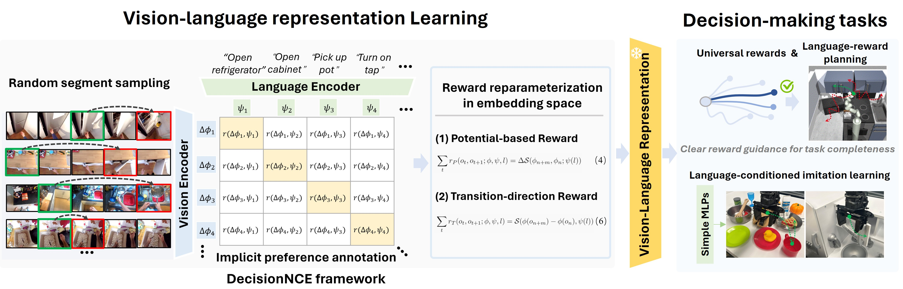
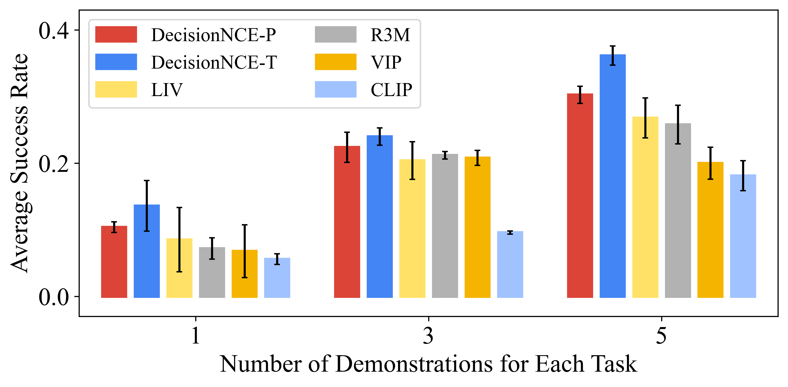
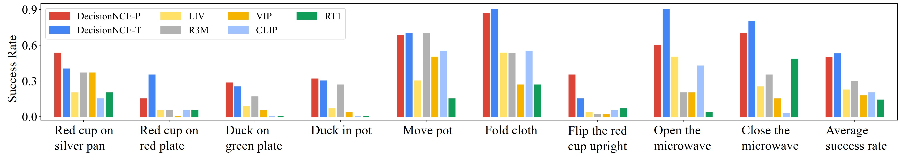

# DecisionNCE: Representaciones Multimodales Embodidas mediante Aprendizaje de Preferencias Implícitas

[[Project Page](https://2toinf.github.io/DecisionNCE/)]  [[Paper](https://arxiv.org/pdf/2402.18137.pdf)]

🔥 **DecisionNCE ha sido aceptado por ICML2024 y seleccionado como artículo destacado en el workshop MFM-EAI@ICML2024**

## Introducción

***DecisionNCE*** refleja un objetivo estilo InfoNCE pero está diseñado específicamente para tareas de toma de decisiones, proporcionando un marco de aprendizaje de representaciones embodiment que **extrae elegantemente características de progresión de tareas tanto locales como globales**, con una consistencia temporal reforzada a través del aprendizaje contrastivo de tiempo implícito, mientras **asegura el anclaje de instrucciones a nivel de trayectoria** mediante una codificación multimodal conjunta. La evaluación tanto en robots simulados como reales demuestra que DecisionNCE facilita eficazmente diversas tareas de aprendizaje de políticas downstream, ofreciendo una solución versátil para el aprendizaje unificado de representaciones y recompensas.

<p align="center"> 
	 
</p>

## Contenido

- [Inicio Rápido](#quick-start)
- [Entrenamiento](#Train)
- [Model Zoo](#model-zoo)
- [Evaluación](#Evaluation)

## Inicio Rápido

### Instalación

1. Clone este repositorio y navegue a la carpeta DecisionNCE

```bash
git clone https://github.com/2toinf/DecisionNCE.git
cd DecisionNCE
```

2. Instale el Paquete

```bash
conda create -n decisionnce python=3.8 -y
conda activate decisionnce
pip install torch==1.13.1 torchvision==0.14.1 --index-url https://download.pytorch.org/whl/cpu
pip install -e .
```

### Uso

```python

import DecisionNCE
import torch
from PIL import Image
# Cargue su modelo DecisionNCE

device = "cuda" if torch.cuda.is_available() else "cpu"
model = DecisionNCE.load("DecisionNCE-P", device=device)

image = Image.open("Ruta de su Imagen Aquí")
text = "Su Instrucción Aquí"

with torch.no_grad():
    image_features = model.encode_image(image)
    text_features = model.encode_text(text)
    reward = model.get_reward(image, text) # tenga en cuenta que el número de imágenes y textos debe ser el mismo
```

### API

#### `decisionnce.load(name, device)`

Devuelve el modelo DecisionNCE especificado por el nombre del modelo devuelto por `decisionnce.available_models()`. Descargará el modelo según sea necesario. El argumento `name` debe ser `DecisionNCE-P` o `DecisionNCE-T`.

El dispositivo para ejecutar el modelo puede especificarse opcionalmente; el valor predeterminado es usar el primer dispositivo CUDA si existe, de lo contrario, la CPU.

---

El modelo devuelto por `decisionnce.load()` admite los siguientes métodos:

#### `model.encode_image(image: Tensor)`

Dado un lote de imágenes, devuelve las características de imagen codificadas por la parte de visión del modelo DecisionNCE.

#### `model.encode_text(text: Tensor)`

Dado un lote de tokens de texto, devuelve las características de texto codificadas por la parte de lenguaje del modelo DecisionNCE.

## Entrenamiento

### Preentrenamiento

Preentrenamos el codificador de visión y lenguaje conjuntamente con DecisionNCE-P/T en el conjunto de datos [EpicKitchen-100](https://epic-kitchens.github.io/2024). Proporcionamos el código y el script de entrenamiento en este repositorio. Siga las instrucciones a continuación para iniciar el entrenamiento.

1. Preparación de datos

Siga las instrucciones oficiales y descargue las imágenes RGB de EpicKitchen-100 [aquí](https://github.com/epic-kitchens/epic-kitchens-download-scripts?tab=readme-ov-file). Además, proporcionamos nuestras [anotaciones de entrenamiento](https://github.com/2toinf/DecisionNCE/blob/main/assets/EpicKitchen-100_train.csv) reorganizadas según la versión oficial.

2. Iniciar entrenamiento

Utilizamos [Slurm](https://slurm.schedmd.com/documentation.html) para el ajuste fino distribuido en múltiples nodos.

```bash
sh ./script/slurm_train.sh
```

Complete la ruta de sus imágenes y anotaciones en la ubicación especificada del [script](https://github.com/2toinf/DecisionNCE/blob/main/script/slurm_train.sh).

## Model Zoo

| Modelos    | Métodos de Preentrenamiento | Parámetros<br />(M) | Iters | ckpt de Preentrenamiento                                                                              |
| --------- | --------------------------- | --------------- | ----- | ------------------------------------------------------------------------------------------ |
| RN50-CLIP | DecisionNCE-P                | 386             | 2W    | [link](https://drive.google.com/file/d/1LmDHaKMZCv9QT89dWubZ8dRo6qwpVMYo/view?usp=drive_link) |
| RN50-CLIP | DecisionNCE-T                | 386             | 2W    | [link](https://drive.google.com/file/d/14wn2R5ZDNujSq9Tsaeuy6fJNr6zM5l7E/view?usp=drive_link) |

## Evaluación

### Resultados

1. Simulación

<p align="center"> 
	 
</p>

1. Robot real

<p align="center"> 
	 
</p>

### Visualización

Proporcionamos nuestro [jupyter notebook]() para visualizar las curvas de recompensa. Por favor, instale jupyter notebook primero.

```python
conda install jupyter notebook
```

---

POR ACTUALIZAR

### Citación

Si considera que nuestro código y artículo son de ayuda, cite nuestro trabajo como:

```
@inproceedings{lidecisionnce,
  title={DecisionNCE: Embodied Multimodal Representations via Implicit Preference Learning},
  author={Li, Jianxiong and Zheng, Jinliang and Zheng, Yinan and Mao, Liyuan and Hu, Xiao and Cheng, Sijie and Niu, Haoyi and Liu, Jihao and Liu, Yu and Liu, Jingjing and others},
  booktitle={Forty-first International Conference on Machine Learning}
}
```
