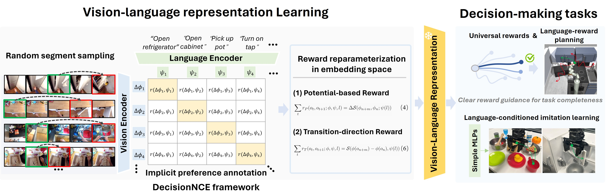

# DecisionNCE: Embodied Multimodal Representations via Implicit Preference LearningnNCE

[[Project Page](https://2toinf.github.io/DecisionNCE/)]  [[Paper]()]

## Introduction

***DecisionNCE*** , mirrors an InfoNCE-style objective but is distinctively tailored for decision-making tasks, providing an embodied representation learning framework that elegantly  **extracts both local and global task progression features** , with temporal consistency enforced through implicit time contrastive learning, while **ensuring trajectory-level instruction grounding** via multimodal joint encoding. Evaluation on both simulated and real robots demonstrates that DecisionNCE effectively facilitates diverse downstream policy learning tasks, offering a versatile solution for unified representation and reward learning.

 
	 

## Contents

- [Quick Start](#quick-start)
- [Dataset](#Dataset)
- [Model Zoo](#model-zoo)
- [Result](#Result)

## Quick Start

## Dataset

## Model Zoo

## Result
