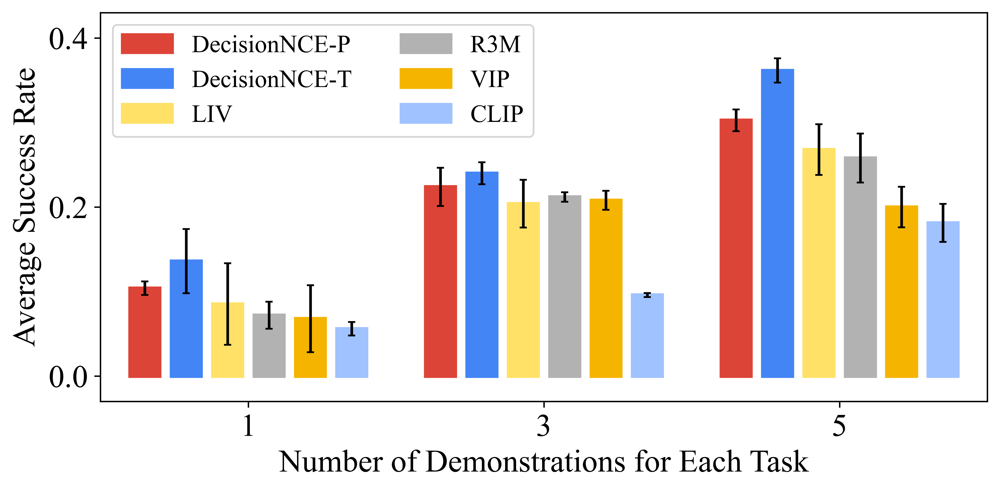

# DecisionNCE: Embodied Multimodal Representations via Implicit Preference LearningnNCE

[[Project Page](https://2toinf.github.io/DecisionNCE/)]  [[Paper]()]

## Introduction

***DecisionNCE*** , mirrors an InfoNCE-style objective but is distinctively tailored for decision-making tasks, providing an embodied representation learning framework that elegantly  **extracts both local and global task progression features** , with temporal consistency enforced through implicit time contrastive learning, while **ensuring trajectory-level instruction grounding** via multimodal joint encoding. Evaluation on both simulated and real robots demonstrates that DecisionNCE effectively facilitates diverse downstream policy learning tasks, offering a versatile solution for unified representation and reward learning.

<p align="center"> 
	 
</p>

## Contents

- [Quick Start](#quick-start)
- [Train](#Train)
- [Model Zoo](#model-zoo)
- [Evaluation](#Evaluation)

## Quick Start

### Install

1. Clone this repository and navigate to DecisionNCE folder

```bash
git clone https://github.com/2toinf/DecisionNCE.git
cd DecisionNCE
```

2. Install Package

```bash
conda create -n decisionnce python=3.10 -y
conda activate decisionnce
pip install --upgrade pip
pip install git+https://github.com/openai/CLIP.git
pip install -e .
```

### Usage


## Train

### Pretrain

We pretrain vision and language encoder jointly with DecisionNCE-P/T on [EpicKitchen-100](https://epic-kitchens.github.io/2024) dataset. We provide training code and script in this repo. Please follow the instructions below to start training.

1. Data preparation

Please follow the offical instructions and download the EpicKitchen-100 RGB images [here](https://github.com/epic-kitchens/epic-kitchens-download-scripts?tab=readme-ov-file). We reorganized the official annotations into our [training annotations](https://github.com/2toinf/DecisionNCE/blob/main/assets/EpicKitchen-100_train.csv).

2. start training

We use [Slurm](https://slurm.schedmd.com/documentation.html) for multi-node distributed  finetuning.

```bash
sh ./script/slurm_train.sh
```

Please fill in your image and annotation storage path in the specified location of the [script](https://github.com/2toinf/DecisionNCE/blob/main/script/slurm_train.sh).

### Finetune

============ Updating ==============

## Model Zoo

| Models    | Pretained Methods | Params<br />(M) | Pretraining Iters | Pretrain ckpt |
| --------- | ----------------- | --------------- | ----------------- | ------------- |
| RN50-CLIP | DecisionNCE-P     | 386             | 2W                | [link]()         |
| RN50-CLIP | DecisionNCE-T     | 386             | 2W                | [Link]()         |

## Evaluation

============ Updating ==============

### Result

1. simulation

<p align="center"> 
	 
</p>

1. real robot

<p align="center"> 
	 
</p>


### Visualization

We provide our [jupyter notebook]() to visualize the reward curves.
